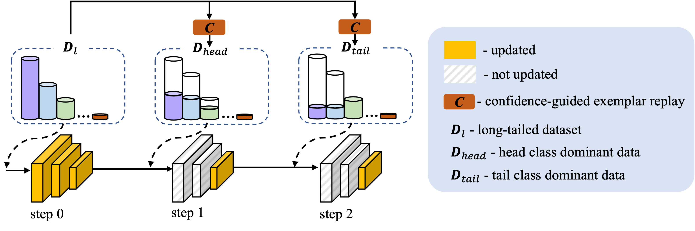
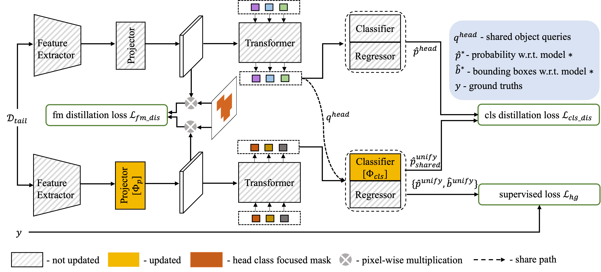

**About**

This is the source code of our paper:

Na Dong, Yongqiang Zhang, Mingli Ding, Gim Hee Lee. Incremental-DETR: Boosting Long-tailed Object Detection via Step-wise Learning on Smooth-tail Data. In ICCV2023.

**Abstract**

Real-world data tends to follow a long-tailed distribution, where the class imbalance results in dominance of the head classes during training. 
In this paper, we propose a frustratingly simple but effective step-wise learning framework to gradually enhance the capability of the model in detecting all categories of long-tailed datasets. 
Specifically, we build smooth-tail data where the long-tailed distribution of categories decays smoothly to correct the bias towards head classes.
We pre-train a model on the whole long-tailed data to preserve discriminability between all categories.
We then fine-tune the class-agnostic modules of the pre-trained model on the head class dominant replay data to get a head class expert model with improved decision boundaries from all categories. 
Finally, we train a unified model on the tail class dominant replay data while transferring knowledge from the head class expert model to ensure accurate detection of all categories.
Extensive experiments on long-tailed datasets LVIS v0.5 and LVIS v1.0 demonstrate the superior performance of our method, where we can improve the AP with ResNet-50 backbone from 27.0\% to 30.3\% AP, and especially for the rare categories from 15.5\% to 24.9\% AP. Our best model using ResNet-101 backbone can achieve 30.7\% AP, which suppresses all existing detectors using the same backbone.

<p align="center">
  
</p>

<p align="center">
  
</p>

For more details, please refer to [our paper](https://openaccess.thecvf.com/content/ICCV2023/html/Dong_Boosting_Long-tailed_Object_Detection_via_Step-wise_Learning_on_Smooth-tail_Data_ICCV_2023_paper.html).

```Bibtex
@InProceedings{Dong_2023_ICCV,
    author    = {Dong, Na and Zhang, Yongqiang and Ding, Mingli and Lee, Gim Hee},
    title     = {Boosting Long-tailed Object Detection via Step-wise Learning on Smooth-tail Data},
    booktitle = {Proceedings of the IEEE/CVF International Conference on Computer Vision (ICCV)},
    month     = {October},
    year      = {2023},
    pages     = {6940-6949}
}
```


## Installation

### Requirements

* Linux, CUDA>=9.2, GCC>=5.4
  
* Python>=3.7

    We recommend you to use Anaconda to create a conda environment:
    ```bash
    conda create -n deformable_detr python=3.7 pip
    ```
    Then, activate the environment:
    ```bash
    conda activate deformable_detr
    ```
  
* PyTorch>=1.5.1, torchvision>=0.6.1 (following instructions [here](https://pytorch.org/))

    For example, if your CUDA version is 9.2, you could install pytorch and torchvision as following:
    ```bash
    conda install pytorch=1.5.1 torchvision=0.6.1 cudatoolkit=9.2 -c pytorch
    ```
  
* Other requirements
    ```bash
    pip install -r requirements.txt
    ```

### Compiling CUDA operators
```bash
cd ./models/ops
sh ./make.sh
# unit test (should see all checking is True)
python test.py
```


## Usage

### Dataset preparation

Please follow the instructions in [ BalancedGroupSoftmax
](https://github.com/FishYuLi/BalancedGroupSoftmax) to prepare LVIS dataset.


## Acknowledgements

The code is build on previous work code. If you use our code, please also consider cite:

```bibtex
@article{zhu2020deformable,
  title={Deformable DETR: Deformable Transformers for End-to-End Object Detection},
  author={Zhu, Xizhou and Su, Weijie and Lu, Lewei and Li, Bin and Wang, Xiaogang and Dai, Jifeng},
  journal={arXiv preprint arXiv:2010.04159},
  year={2020}
}
```

